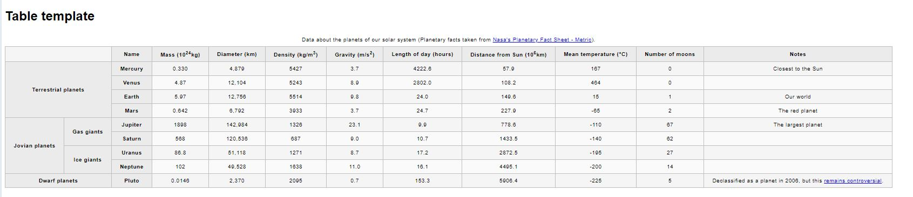
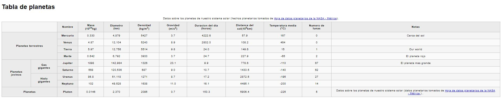

# Examen 4 Gabriel Neves

## Objetivo a cumplir del trabajo

### links usado
<a href="https://github.com/mdn/learning-area/blob/master/html/tables/assessment-start/blank-template.html">html</a>

### link CSS
<a href="https://github.com/mdn/learning-area/blob/master/html/tables/assessment-start/minimal-table.css">css</a>

### link de ayuda
<a href="https://developer.mozilla.org/en-US/docs/Learn/HTML/Tables/Structuring_planet_data#Assessment_or_further_help">ayuda</a>

1. Tenemos que abrir el visual studios y abrir una carpeta con el css y el index
2. Posteriormente emos de usar los codigos necesarios para hacer las tablas (td, th, table...)
3. El resultado tiene que estar en español
4. Una vez acabado hay que subrilo a tu cuenta de github y en hay que descomprimir la carpeta en un zip y subirlo al moodle

### Resultado del trabajo

#### Gabriel Neves

